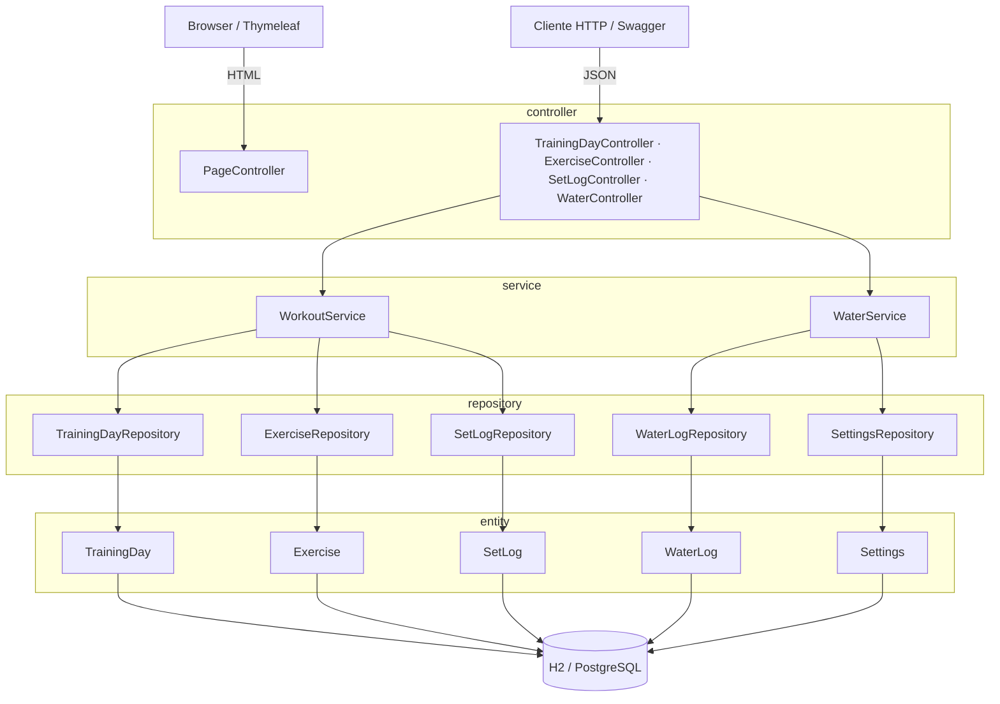

# Treino Tracker API

API REST (com frontend Thymeleaf) para acompanhar evolução de treino e hidratação diária. Calcula o 1RM estimado de cada série pela fórmula de Epley e a tendência de progressão semana a semana, além de controlar consumo de água contra uma meta diária configurável.

Este projeto é a reescrita, como serviço web, de um app de console em Java ([`treino-tracker`](https://github.com/arthurcamargo03/treino-tracker)) que tinha a mesma lógica de domínio.

## Demo

- **Aplicação:** `<URL da demo após o deploy>`
- **Swagger UI:** `<URL da demo>/swagger-ui.html`

> As URLs acima são preenchidas após o deploy (ver seção [Deploy](#deploy)).

## Stack

- **Java 21** + **Spring Boot 3.5** (Web, Data JPA, Validation)
- **H2** (arquivo local, perfil `dev`) e **PostgreSQL** (perfil `prod`)
- **Flyway** para migrations versionadas do schema
- **Thymeleaf** + **Bootstrap 5** + **Chart.js 4** (frontend server-side consumindo a própria API via `fetch`)
- **springdoc-openapi** (Swagger UI)
- **JUnit 5 + Mockito + AssertJ** para testes
- **Docker** para build/deploy

## Arquitetura em camadas



Regras de domínio (1RM de Epley, melhor série por semana, `trendPercent`, meta/garrafa de hidratação e organização por treino) ficam isoladas em `service`; `controller` só traduz HTTP ↔ DTO e nunca expõe entidades JPA diretamente.

### Principais endpoints

| Recurso | Endpoint |
|---|---|
| Treinos | `GET/POST /api/training-days` |
| Exercícios | `GET/POST /api/exercises`, `GET /api/exercises/{id}` |
| Séries e progressão | `POST /api/exercises/{id}/sets`, `GET /api/exercises/{id}/progression` |
| Hidratação | `GET /api/water/today`, `POST /api/water/drink`, `GET/PUT /api/water/settings` |

Lista completa, com schemas e exemplos, no Swagger UI (`/swagger-ui.html`).

## Como rodar local

Pré-requisitos: Java 21 e Maven (ou use o wrapper `./mvnw` incluído).

```bash
git clone https://github.com/arthurcamargo03/treino-tracker-api.git
cd treino-tracker-api
./mvnw spring-boot:run
```

A aplicação sobe em `http://localhost:8080` usando o perfil `dev` (padrão), com H2 em modo arquivo (dados persistidos em `./data/`). O schema é criado pelo Flyway e validado pelo Hibernate. Console do H2 em `/h2-console` (JDBC URL `jdbc:h2:file:./data/treinotracker`, usuário `sa`, sem senha).

- Frontend: `http://localhost:8080/exercises` e `http://localhost:8080/water`
- Swagger UI: `http://localhost:8080/swagger-ui.html`

Para subir com dados de exemplo (3 exercícios com históricos diferentes — progredindo, forte e estagnado):

```bash
./mvnw spring-boot:run -Dspring-boot.run.profiles=dev
```

Rodar os testes:

```bash
./mvnw test
```

### Rodando com Docker

Build da imagem (multi-stage: compila com Maven+JDK 21 e roda só o `.jar` sobre `eclipse-temurin:21-jre`) e execução:

```bash
docker build -t treino-tracker-api .
docker run -p 8080:8080 treino-tracker-api
```

Por padrão o container também sobe no perfil `dev` (H2 dentro do próprio container — sem persistência entre execuções). A porta é lida de `PORT` (`server.port=${PORT:8080}`) e o perfil de `SPRING_PROFILES_ACTIVE`, então a mesma imagem serve para a Render sem alteração.

#### Prod local com PostgreSQL (docker-compose)

Para rodar o perfil `prod` contra um Postgres real na sua máquina:

```bash
cp .env.example .env   # ajuste as credenciais se quiser (opcional)
docker compose up --build
```

O `docker-compose.yml` sobe dois serviços: `db` (`postgres:16`, com volume `pgdata` para persistir os dados e healthcheck via `pg_isready`) e `app` (buildado pelo `Dockerfile`, com `SPRING_PROFILES_ACTIVE=prod` e as variáveis `PG*` apontando para o `db`). O `depends_on` espera o banco ficar *healthy* antes de iniciar o app. O Flyway cria o schema no startup e, por ser a primeira execução (banco vazio), o app popula um histórico de exemplo. Acesse `http://localhost:8080/exercises`.

## Deploy

Perfis disponíveis:

- **`dev`** (`application-dev.properties`) — H2 em arquivo, console habilitado, schema via Flyway.
- **`prod`** (`application-prod.properties`) — PostgreSQL via variáveis de ambiente, schema via Flyway, console do H2 desabilitado.

O perfil `prod` lê a conexão exclusivamente de variáveis de ambiente (nunca de valores hardcoded no repositório):

| Variável | Descrição |
|---|---|
| `SPRING_PROFILES_ACTIVE` | `prod` |
| `PGHOST` | host do PostgreSQL |
| `PGPORT` | porta do PostgreSQL |
| `PGDATABASE` | nome do banco |
| `PGUSER` | usuário |
| `PGPASSWORD` | senha |
| `PORT` | porta HTTP da aplicação (injetada automaticamente pela plataforma) |

### Render

O repositório inclui um `render.yaml` (Blueprint) que provisiona um banco PostgreSQL gerenciado e o serviço web a partir do `Dockerfile`, já conectando as variáveis acima automaticamente:

1. No painel da Render, **New > Blueprint** e aponte para este repositório.
2. A Render cria o banco `treino-tracker-db` e o serviço `treino-tracker-api`, já com `SPRING_PROFILES_ACTIVE=prod` e as credenciais do banco injetadas via `fromDatabase`. Nenhuma senha é digitada à mão — tudo vem do banco gerenciado.
3. No primeiro deploy o Flyway roda as migrations e, com o banco vazio, o app popula automaticamente um histórico de exemplo (3 exercícios com progressão realista) para o gráfico já abrir preenchido. Deploys seguintes não reinserem nada.
4. A Render usa `healthCheckPath: /api/exercises` para saber quando o serviço está no ar. Após o deploy, copie a URL pública gerada e atualize a seção [Demo](#demo) deste README.

### Railway

1. **New Project > Deploy from GitHub repo**, selecione este repositório (o Railway detecta o `Dockerfile` automaticamente).
2. Adicione um serviço **PostgreSQL** ao projeto — o Railway expõe `PGHOST`, `PGPORT`, `PGDATABASE`, `PGUSER`, `PGPASSWORD` automaticamente para os demais serviços do mesmo projeto.
3. No serviço da aplicação, defina a variável `SPRING_PROFILES_ACTIVE=prod`.
4. Gere um domínio público em **Settings > Networking** e atualize a seção [Demo](#demo).

## Próximos passos

- Autenticação/autorização (hoje a API é totalmente aberta).
- Paginação em `GET /api/exercises` e histórico de hidratação por período (não só o dia atual).
- Suporte a múltiplos usuários (hoje os dados de treino e hidratação são globais, sem conceito de usuário).
- Pipeline de CI (build + testes) no GitHub Actions antes do deploy.
